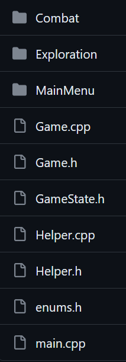

# Design Pattern
> that is relevant to our project 

## Game Loop
[Book Link](https://gameprogrammingpatterns.com/game-loop.html)

You might have noticed a common code piece that is in all raylib games.

```cpp
while (!WindowShouldClose()) {
// do thing...
}
```
This is the game loop. It is called every frame until the game is closed (X button, esc, etc...).

Because raylib is just a library, they don't enforce the game loop design pattern.
But this is how Game Loop is typically composed of

```cpp
while (!WindowShouldClose()) {
  processInput(); // handles any user input that has happened since the last call
  update(); // for our turn-based game, this will mostly be used for animation
  render(); // draw things
}
```


## Command
[Book Link](https://gameprogrammingpatterns.com/command.html)

I'm currently reworking/refactoring the game to use this design pattern for the GameState.

Previously, the GameState was `enum`, `switch`, and functions associated (not code-wise) with said GameState, all inside the `Game` class.

```cpp
enum GameState {
  start_menu,
  loading_overworld,
  overworld,
  loading_combat,
  combat,
};

////////

switch (gameState) {
    case start_menu:
        if (IsKeyPressed(KEY_SPACE)) {
            gameState = loading_overworld;
        }
        renderStartMenu();
        break;
    case loading_overworld:
        loadSave("savedata-01");
        gameState = overworld;
        break;
    case overworld:
        handleUserInputOverworld();
        renderOverworld();
        break;
    case loading_combat:
        break;
    case combat:
        handleUserInputCombat();
        renderCombat();
        break;
}

///////

void Game::handleUserInputOverworld() { //....}
void Game::handleUserInputCombat() { //....}
// and so much more ..... ugh ....

```

This is really messy & confusing.

Instead, using the command and game loop pattern, we can have `GameState` as a class and all the possible GameState inherit from it.
```cpp
// this is abstract, not to be used, is here to be inherited
class GameState {
  public:
    virtual GameState() {};
    virtual ~GameState() {}; // destructor

    virtual void processInput(Game& game) = 0;
    virtual void update(Game& game) = 0;
    virtual void render(Game& game) = 0;
};

// Overworld (World now) inherit from GameState
// it also have its own variables & functions relevant to it
class World : public GameState {
  public:
    World(std::string roomId) override;
    ~World() override; // destructor

    void processInput(Game& game) override;
    void update(Game& game) override;
    void render(Game& game) override;

    // variables & function relevant to the World state go here
    const double moveSpeed = 0.1;
    double lastMoveTime = 0;

    std::queue<std::pair<int, int>> pathQueue;

    Room currentRoom;

    Texture2D background;

    void loadRoom(const std::string& roomId);

    // Helpers
    std::string inputHelper(std::string facing);
    void findShortestPath(Game& game, int startX, int startY, int targetX, int targetY);
};
```

Now we need a way for the `Game` class to use this.
To do that, we add a variable and function.

```cpp
// new pointer to GameState and can be used for class that inherit it
GameState* currentState;

// to switch between states (WIP for now)
void Game::changeState(std::string state) {
  GameState* newState;

  if (state == "mainMenu") {
    newState = new MainMenu();
  }
  else if (state == "world") {
    loadSave("savedata-01");
    newState = new Exploration(currentRoomId);
  }
  else if (state == "combat") {
    newState = new Combat();
  }

  currentState->exit();
  delete currentState;
  currentState = newState;
  currentState->initialize();
}
```

And after moving stuffs from the `Game` class to their proper places,
the game loop in `Game` become really simple.
```cpp
while (!WindowShouldClose()) {
  if (currentState != nullptr) {
    currentState->processInput(*this);
    currentState->update(*this);
    currentState->render(*this);
  }
}
```

Now if you are working on Combat or World. You only need to change the 3 core game loop function in `Combat.cpp` or `World.cpp`. You can also organize it into their own folder.



In case you're wondering about how the `changeState` function might be used.
Here's an example where the game would change to `World` if `space` is pressed when
`currentState` is `MainMenu`
```cpp
void MainMenu::processInput(Game& game) {
  if (IsKeyPressed(KEY_SPACE)) {
    game.changeState("world");
    // game.changeState("combat");
  }
}
```

## Summary
- GameState is separated now. Make it easier to dev and understand stuffs.
- Game class is not hundreds of lines long with functions that you have to connect the dot by yourself.
