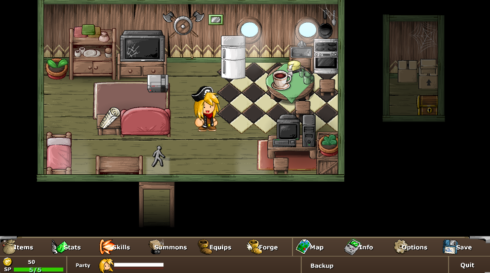
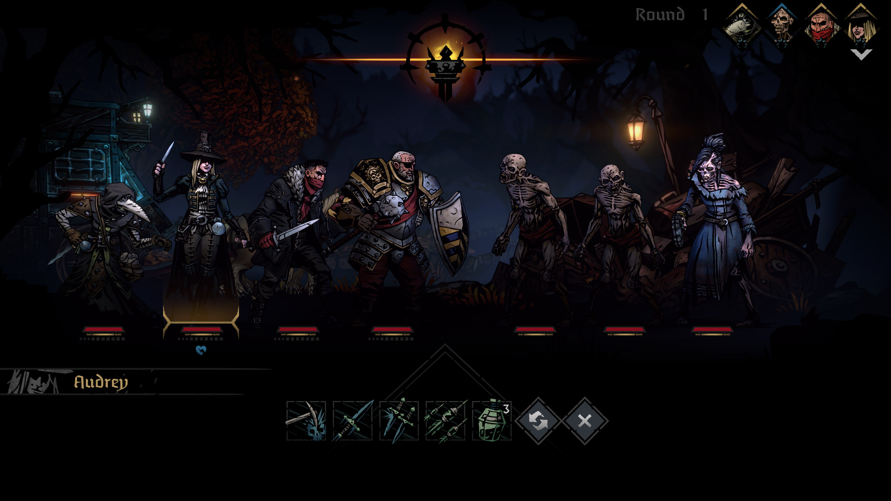
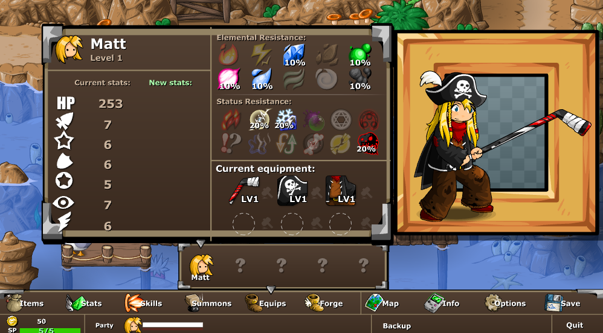
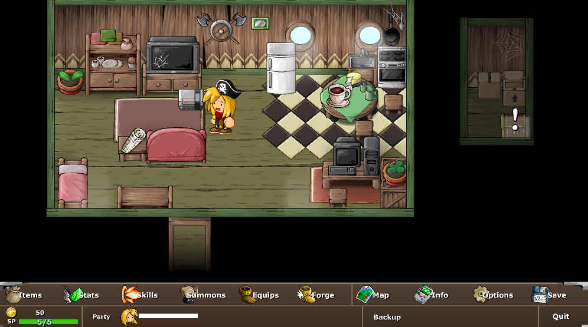
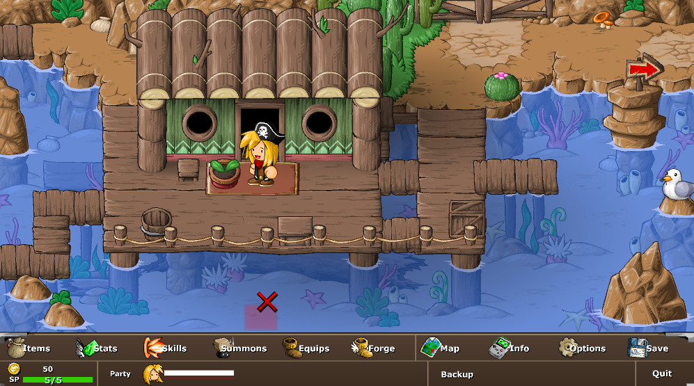
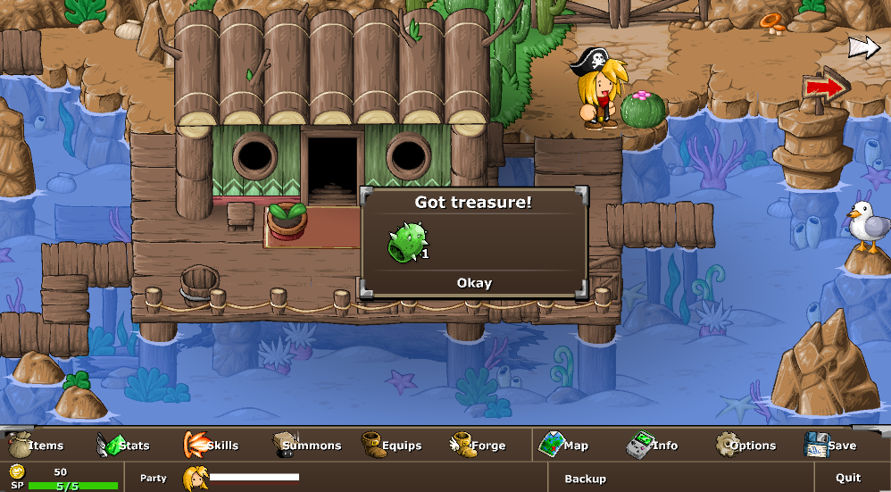

# Game Overview
## Genres / General Mechanics
- Adventure RPG
- Turn-based combat
- Grid-based movement

## Game Flow (including interface)
...

## Mechanics
> Mechanics from other games, to consider, to criticize

### Movement

- Inspiration 1: **EBF3-5 Movement System (Grid)**
    - Keyboard & mouse
    - Player can move around by WASD or by clicking on a tile using a mouse (EBF4-5)
    - If click on a tile, the player character will navigate to that tile
    - We can do keyboard first, then mouse later if we have time since the auto-navigation can be difficult?
    - Player's last facing direction is kept.
    - Pressing the interact key would interact with the tile infront of the player's direction
    - **Luxury:** Party member trail behind the player character
- **Non-grid Movement System**
    - In comparision to grid:
        - Allows real-time combat vs enemies (bullet hell/heaven)
        - Need more precise collision box?

### Combat

    

- Inspiration 1: **Darkest Dungeon Turn-based Combat System**
    - Unit's initiative is decided on their SPEED stat + 1d6
    - There are 4 ranks for player and enemies (4321-1234) (1st rank is the front-most position)
    - Abilities have restriction:
        - Can only perform when in these positions
        - Can only target unit in these positions
    - Abilities can move the units around

---

    

- Inspiration 2: **EBF Equipment System**
    - Every party members have 3 gear slots & 3 charm slots.
    - The 3 gears are:
        - Weapon (mostly change offensive stats)
        - Hat (minor stat changes)
        - Armor (mostly change defensive stats)
    - Gears can have different elemental resistance, stats change, and passive.
    - Charms/Trinkets/Flairs
        - Give specific stats changes or passive
    - Armors is somewhat restricted between party member
        - Allow for 'off-meta' build without breaking the game. For example:
            - Crazy high magic dmg boost equipment on a warrior character (who have very few magic scaling move)
            - Or high physical dmg mage (bonk!)
- Inspiration 3: **EBF Dmg Type System**
    - EBF has both an elemental system & atk/ability dmg system.
    - Elemental DMG System
        - Units have elemental resistance. Abilities have some % of their dmg as elemental.
        - Elemental Resistance range (-1.0-2.0):
            - -1.0-0.0 (-100-0%) increases dmg taken 
            - 0.0-1.0 (0-100%) reduce dmg
            - 1.0-2.0 (100-200%) heal instead of dealing dmg
            - How to code formula: elemental_dmg * (1 - elemental_res) => if result is negative, target heal instead
        - Combat is more puzzle-ly than tactical (correct equipment or elemental res. buff can trivialize combat)
        - Can be difficult to implement. Need data member to keep track of elemental_dmg & elemental_res.
    - Physical/Magic DMG System
        - Abilities are either magical or physical (or none if they do no dmg ie. buff/debuff/statusfx)
        - Armor & magic resistance reduces dmg of the type.
- Inspiration 3: **League Dmg Type**
    - There's 3 types of dmg:
        - Attack dmg (orange) - reduced by armor
        - Magic dmg (blue) - reduced my magic resistance
        - True dmg (white) - does not get reduced
- Inspiration 4: **EBF & DD1 Turn-based Buff/Debuff/Status-Effect**
    - [EBF has some interesting status effects](https://epicbattlefantasy.fandom.com/wiki/Status_Effects)
    - Status effect can be:
        - Bleed, Blight, Poison (DOT)
        - Charge (EBF) (Indicate a strong ability will be cast when it reaches 1) (usually take a lesser action to gain charge)
    - Buff/Debuff changes the unit core stats
- General: **Achievements/Medals**
    - For completetionist
- Inspiration 5: **EBF5 Spell Cooldown**
    - Turn-based combat system (action economy) limit ability design
        - Previous versions of EBF uses a mana (FP) system. Better abilities have higher mana cost.
        - Result: Weaker version was not used because FP recovery was easy
            - Strong abilities + FP recovery is better (better action economy) than many cast of weak abilities.
            - You would rather cast 6 strong abilities & then spent 1 action to recover FP than casting 16 weak abilities.
    - EBF5 fix this by instead of units having mana, they have cooldown instead
- Inspiration 6: **League of Legends Stats**
    - AD, AP, etc. (more in the Objects & Attributes Section)
    - Abilities dmg formula: base_dmg + atk_dmg * ad_scaling + ability_power * ap_scaling
- Inspiration 7: **DD2 No-Dodge/Token System**
    - In DD1, there is the dodge, accuracy, and crit_chance stat. In DD2, they replaced this with dodge & crit tokens. Similarly with the crit token.
    - If the unit has a dodge token, atk on them will have a 50% chance to miss & consume the token regardless.
    - This got rid of the frustrating aspect of DD1, where a 97% chance to hit atk missed. Or when a 10% crit atk from the enemy crit-ed.
    - This make AoE abilities strong as they can clear out the token with the most action economy.

### Game Terms/Phrasing
| Word | Explanation |
|------|-------------|
Round | At a new round, roll for initiative, after every units turn, round end & advance to next round. Some effects may happen on round start or end.
Turn | Units can only act when it is their turn. At the start or end of the unit's turn, some effects may proc/trigger (DOTs, Buff/Debuff duration decrease, etc.)

### Objects & Attributes

**Player's Characters / Party's Member**
| Attribute | Type | Description | Inspiration |
|-----------|------|-------------|-------------|
max_hp | float | SE | |
current_hp | float | SE | |
atk_dmg | int | changes abilities dmg depending on their atk_dmg_scaling | League
ability_power | int | changes abilities dmg depending on their spell_dmg_scaling | League
armor | int | physical dmg negation (weird formula) | League
magic_res | int | magic dmg negation (also weird formula) | League
fire_res, earth_res, etc. | float (-1.0-2.0) | Increase, decrease, or even heal elemental dmg to the character | EBF
omnivamp | unsigned float | heal hp from post-mitigation dmg (no matter the type) | League

**Abilities**
| Attribute | Type | Description | Inspiration |
|-----------|------|-------------|-------------|
base_dmg | int | | League
elemental_type | string | see below | EBF3-4
elemental_scaling | float (0.0-1.0) | How much (0-100%) of the total dmg  is of the elemental_type? | EBF3-4
atk_dmg_scaling | unsigned float | | League
ap_scaling | unsigned float | | League
cast_rank | string | maybe store as "--**" => only castable in rank 1 & 2 | DD
target_rank | string | same as above but reverse | DD
movement_after_cast | string | "f2" means move forward 2 ranks, "b1" means move backward 1 rank | DD
ability_cooldown | unsigned int | Amount of round before the ability can be casted again. Non-cooldown abilities are denoted with 0 as their ability_cooldown | EBF5
castable_round | int | current_round must be < castable_round to be able to cast. After ability cast, set to current_round + ability_cooldown + 1 | EBF5

<!-- current_cooldown | int | Use to keep track of the ability cooldown. Ability can only be cast if current cooldown is < 0. Set to -1 for abilities with no cooldown | EBF5 -->

## Interface
**Settings**
- Maybe no resolution change, windowed mode only
    - Less bug, make dev & artist happy, a more consistent experience for players

# Notes
I have the inspiration column so that it's easier to keep track & imagine the mechanic/idea in case you are familiar with those games.

EBF3-5 is really close to what our current game description want:
- Grid/Tile-based Movement System
- Turn-based Combat
- Adventure RPG

It's an old game franchise (from the flash game era), but it's pretty good.
The art style is do-able and scalable for me.
So I think it's a good reference for our game.

Here's some screenshot of the game. The game has online version for you to test it out.
[Here is the link to EBF5](https://www.gameflare.com/online-game/epic-battle-fantasy-5/).

## Misc.

SE = Self-explanatory

DD = Darkest Dungeon

EBF = Epic Battle Fantasy (3-5).

The EBF5 is a bit different from the 3 & 4 version (Combat, etc.).

4 is a more polished 3 (especially the UI).

Luxury => This feature is not necessary but can be implemented to improve the game's polish.
