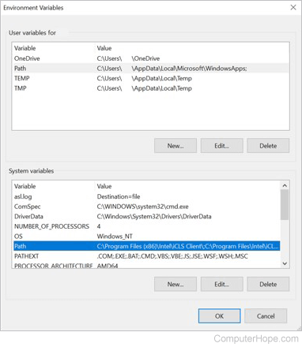

# For Windows (VSCode) (Window 10)
- Download & install [raylib](https://raysan5.itch.io/raylib) (this might take a while)
- Go to your Window Settings & search for `Edit the system environment variables`
- If the window doesn't look like this, select `Environment Variables`

<div align='center'>

</div>

- Select `Path` (the top one (user))
- Select `Edit`
- Select `New`
- Paste this (changes the C if you installed it on a different drive)
```
C:\raylib\w64devkit\bin
```
- Select `Ok` twice
- Maybe close & open VSCode (if you opened it before this step)
- Open the included first-window folder in VSCode.
- Open `main.cpp`
- <kbd>Ctrl</kbd> + <kbd>Shift</kbd> + <kbd>P</kbd> to open the Command Palette
- Select `Tasks: Run Tasks`
- Select `build debug`. This will produces a main.exe file.
- Run the `main.exe`


# For Arch Linux

```bash
# use paru or your fav. AUR helpers to install raylib
paru -S raylib

# to compile manually (you might not need all these flags)
g++ your_code.cpp -lraylib -lGL -lopenal -lm -pthread -ldl -lX11 -lXrandr -l Xinerama -lXi -l Xxf86vm -lXcursor

# or use the included Makefile
make all
```
